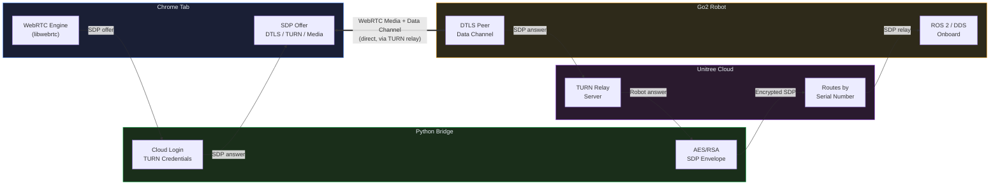
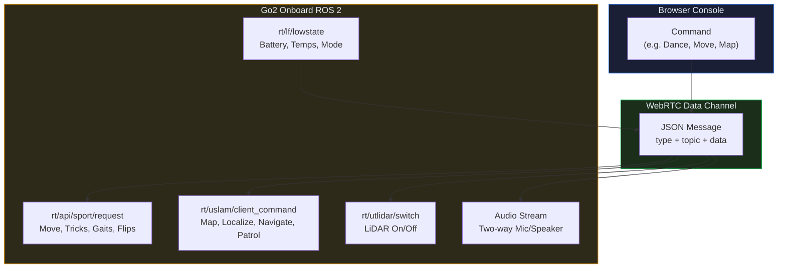
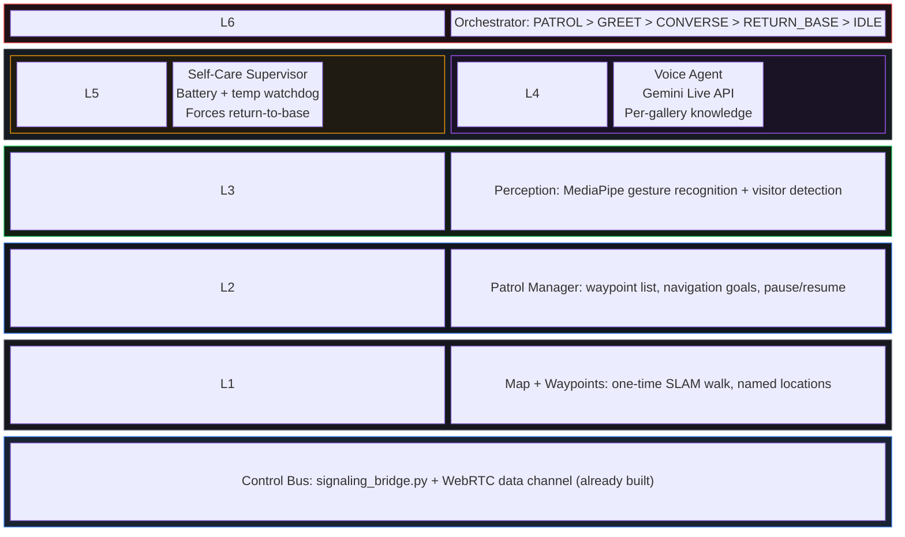

# Go2 Chrome Console

**A browser-based control console for the Unitree Go2 robot dog, connected over the internet via WebRTC.**

Built from scratch by reverse-engineering the encrypted official mobile app and reimplementing its entire control stack as a web application. No SDK, no same-LAN requirement, no Tailscale. Just open Chrome, connect to the robot from anywhere.

> This repository is a project showcase. The full source code is maintained in a private repository.  
> I'm happy to do a live demo or code walkthrough on request.

---

## What it does

A single-page web console that connects to a Unitree Go2 EDU over the cloud (WebRTC), streams its camera and audio live, drives it with keyboard controls, triggers its full trick and gait repertoire, decodes and renders its LiDAR point cloud in 3D, and runs the robot's own SLAM mapping with autonomous patrol. All of this was reverse-engineered from the encrypted phone app.

---

## The Breakthrough

The core technical challenge was getting a browser to control the robot remotely (different network) over WebRTC.

**The problem:** Every existing open-source project either works only on the same LAN, or uses Python's `aiortc` library which fails the DTLS handshake over Unitree's TURN relay. The connection negotiates ICE to `completed`, then dies during DTLS and times out. This is a known `aiortc` limitation (GitHub issues #593, #413) because its pure-Python DTLS path is fragile over relayed connections.

**The insight:** Unitree's cloud signaling is completely decoupled from the WebRTC engine. Connecting requires just two HTTPS calls: one for TURN credentials, one to exchange the SDP offer/answer wrapped in an AES/RSA envelope. The robot does not care what engine produced the offer.

**The solution:** Let Chrome's built-in `libwebrtc` (the same battle-tested engine the phone app uses) be the WebRTC peer. Python handles only the cloud authentication and SDP envelope. The browser does the actual DTLS handshake, TURN relay, and media.

No public project had done browser-over-cloud control of the Go2 before this. I verified this against every existing open-source Go2 WebRTC project.

### The exact fixes that unlocked it (in order)

1. **Cached the login token** so it doesn't re-authenticate per request (re-logging triggered Unitree's API rate limit, HTTP 567).
2. **Chrome, not aiortc, creates the RTCPeerConnection + offer + handles DTLS.** This was the key architectural decision.
3. **Wrapped the SDP in the dog's JSON envelope** before AES-encrypting. Sending a bare SDP returned `code=500`.
4. **Camera-only offer** on the dashboard (drop audio from the initial negotiation) so the dog accepts cleanly.
5. **Validation handshake**: the dog sends a challenge over the data channel; the client replies with the correct hash, then publishes `"on"` to start media.

---

## How the Dog Understands Commands

Once the WebRTC connection is up, there is one data channel named `"data"`. Everything after connect is JSON messages over that single channel, published directly to the robot's internal ROS 2 topics.

The robot is effectively a ROS 2 robot with a WebRTC bridge in front of it. Once you hold that data channel, you have the same control surface the phone app has. The dog does not know or care whether the command came from the official app or this console.

---

## What Was Reverse-Engineered

The Unitree app frontend is a Vue/Vite web bundle, AES-encrypted, served by a local NanoHTTPD server inside the APK. I cracked the asset encryption, found the AES key and IV in the app's Java source, decrypted all the JS bundles, and mined the exact wire protocols from them.

What I extracted:
- The full sport command envelope and api-id enums, including the undocumented `mcf`-mode IDs that differ from the SDK documentation
- The uSLAM command vocabulary (plain slash-strings, not JSON) for mapping, localization, navigation, and patrol
- The LiDAR voxel format: LZ4-compressed 128x128xN occupancy bitfield. Reimplemented the decoder from scratch in pure JavaScript.

---

## Features (all working)

| Feature | Description |
|---|---|
| **Live Camera** | WebRTC video stream from the robot's front camera |
| **Two-Way Audio** | Listen to the robot's microphone, talk through its speaker via push-to-talk |
| **WASD Driving** | Keyboard teleop via the robot's sport Move velocity command with speed control |
| **Full Trick Set** | Postures, dances, greetings, gaits (StaticWalk, TrotRun, etc.), AI walks, handstand, flips |
| **LiDAR 3D Viewer** | Decodes the robot's voxel stream into a point cloud, rendered with orbit/zoom/pan camera and live heading arrow |
| **SLAM Mapping** | Build a map using the robot's onboard SLAM, save it, reload it |
| **Autonomous Patrol** | Drop waypoints on the 3D map, run a looping patrol with pause/resume |
| **Live Telemetry** | Battery SOC, voltage, current, motor temps, BMS/IMU temps, mode, gait |
| **Emergency Stop** | SPACE key halts drive, patrol, and navigation instantly |
| **Gesture Control** | Prototype: browser MediaPipe hand detection triggers tricks on the robot |
| **AI Voice Agent** | Prototype: Gemini-powered voice agent using the robot's mic/speaker |

---

## Screenshots

### Full Dashboard: Camera + LiDAR + Controls + Telemetry

### Dense LiDAR Point Cloud with Full Control Panel

### SLAM Patrol Mode with Waypoints

### SLAM Mapping Workflow

### 106K Point LiDAR Scan with Voice Panel

---

## Demo Video

The full demo video (camera, driving, tricks, LiDAR, SLAM, patrol) is too large for GitHub.

**Watch it here:** *[YouTube link coming soon]*

---

## Autonomy Architecture: Project ROSE

Beyond remote control, I designed a six-layer autonomy architecture for an autonomous gallery docent use case. Each layer is an independent module, built and verified separately, coordinated by a top-level state machine.

**Priority:** Self-Care > Visitor Interaction > Patrol

The key architectural decision: let the robot navigate itself with Unitree's onboard SLAM. The orchestrator stays the high-level brain and never runs a real-time motion loop over the cloud. This keeps the entire system inside the latency envelope.

---

## Tech Stack

| Layer | Technologies |
|---|---|
| **Backend** | Python, aiohttp (async HTTP server), Unitree cloud crypto (AES-CBC + RSA) |
| **Frontend** | Single-page HTML/JS, Three.js (3D LiDAR), WebAudio (two-way audio) |
| **Networking** | WebRTC (Chrome libwebrtc), DTLS, TURN, ICE, data channels |
| **Robotics** | ROS 2 / DDS topics over WebRTC, SLAM, sport/gait control, LiDAR voxel decode |
| **Reverse Engineering** | APK decompilation, AES asset decryption, protocol mining from obfuscated JS/DEX |
| **Perception** | MediaPipe gesture detection, LZ4 decompression (WASM), voxel-to-point-cloud decoder |
| **AI** | Gemini Live API for voice agent (prototype) |

---

## How I Built This

This project was built through a combination of hands-on reverse engineering and AI-assisted development with Claude. The reverse engineering (APK cracking, protocol mining, hardware debugging) was manual work. The software implementation was pair-programmed with Claude, where I directed the architecture and Claude helped write and iterate on the code.

The hardest problems were not code problems. They were:
- Figuring out that `aiortc` fundamentally cannot complete DTLS over a TURN relay, and that the solution was to let Chrome be the WebRTC engine
- Cracking the app's AES-encrypted JS bundles to recover the undocumented command protocol
- Diagnosing a coordinate-frame mismatch (raw lidar-odom vs saved-map frame) that caused every navigation goal to return NO_PATH
- Reimplementing the LiDAR voxel-bitfield decoder from the app's obfuscated source

---

## Prior Art

These projects exist in the Go2 WebRTC space. None of them do browser-over-cloud.

- [legion1581/unitree_webrtc_connect](https://github.com/legion1581/unitree_webrtc_connect) - Python/aiortc, cloud signaling crypto (I reuse this for the crypto layer)
- [tfoldi/go2-webrtc](https://github.com/tfoldi/go2-webrtc) - Browser-based, LAN only
- [phospho-app/go2_webrtc_connect](https://github.com/nicholaswma/go2_webrtc_connect) - Python, cloud
- [lesh/go2-webrtc-deno](https://github.com/lesh/go2-webrtc-deno) - Deno, cloud

---

## License

This repository contains documentation, screenshots, and architectural diagrams only. The source code is proprietary and maintained in a private repository.

Documentation: [CC BY-NC-ND 4.0](https://creativecommons.org/licenses/by-nc-nd/4.0/)

Copyright 2026. All rights reserved.
