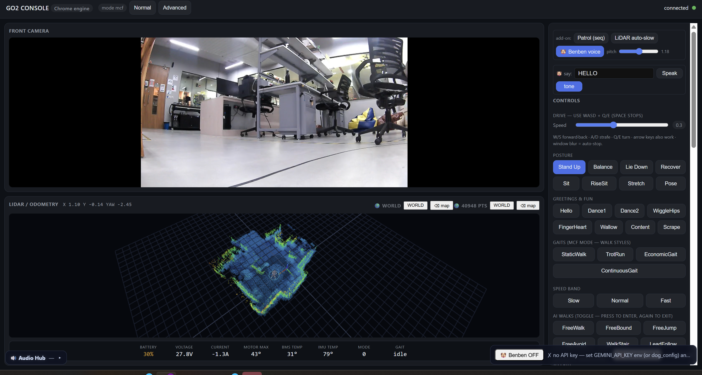
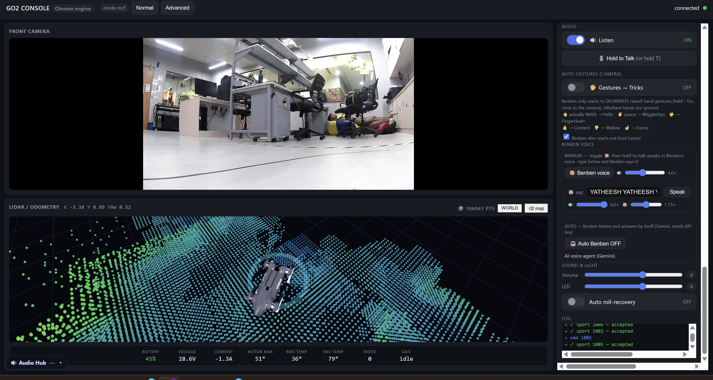
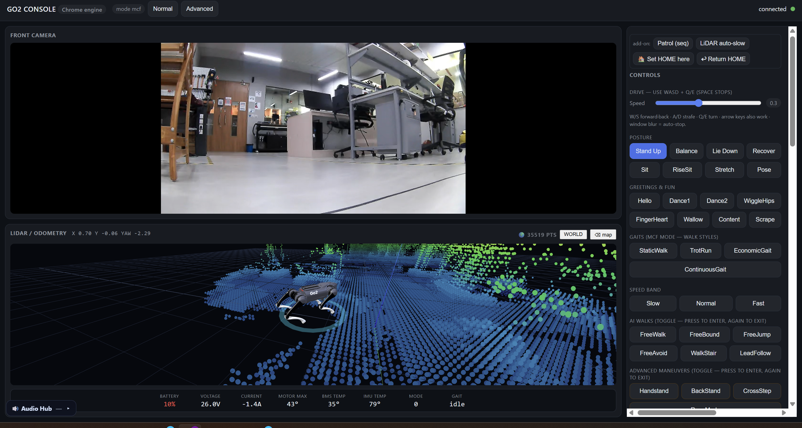
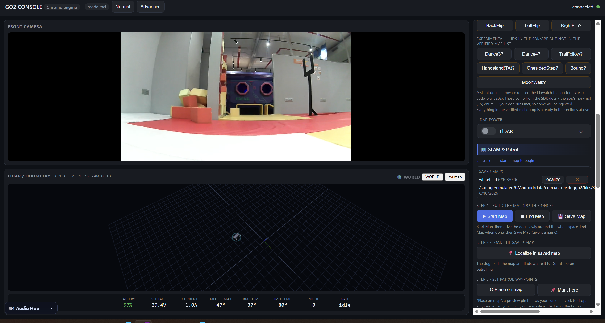
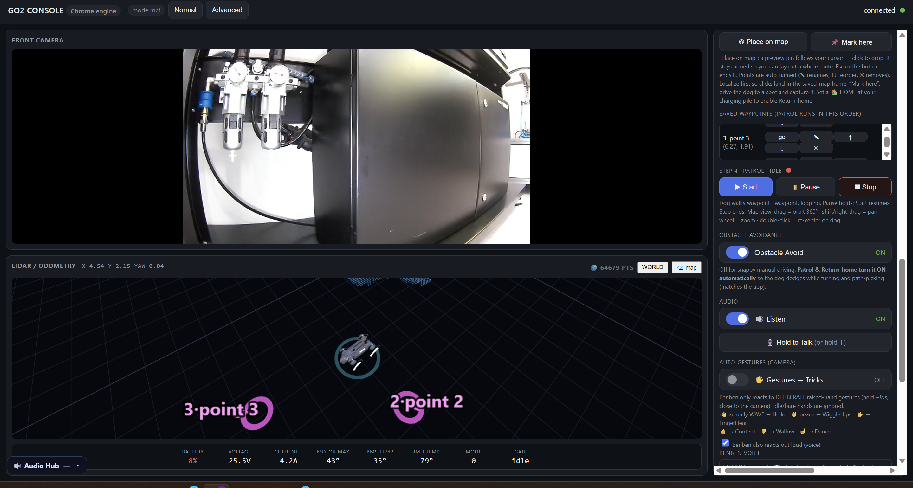

# Go2 Chrome Console

**A browser-based control console for the Unitree Go2 robot dog, connected over the internet via WebRTC.**

Built from scratch by reverse-engineering the encrypted official mobile app and reimplementing its entire control stack as a web application. No SDK, no same-LAN requirement, no Tailscale. Just open Chrome, connect to the robot from anywhere.

> This repository is a project showcase. The full source code is maintained in a private repository.
> I am happy to do a live demo or code walkthrough on request.

---

## Screenshots

### Full Dashboard: Camera + LiDAR + Controls + Telemetry


### Dense LiDAR Point Cloud (106K points) with Go2 3D Model


### All Controls: Gaits, AI Walks, Flips, Advanced Maneuvers


### SLAM Mapping Workflow


### Autonomous Patrol with Waypoints on 3D Map


---

## Demo Video

Full demo (camera, driving, tricks, LiDAR, SLAM, patrol) is too large for GitHub.

**Watch it here:** *[YouTube link coming soon]*

---

## The Breakthrough

The core technical challenge was getting a browser to control the robot remotely (different network) over WebRTC.

**The problem:** Every existing open-source project either works only on the same LAN, or uses Python's `aiortc` library which fails the DTLS handshake over Unitree's TURN relay. The connection negotiates ICE to `completed`, then dies during DTLS and times out. This is a known `aiortc` limitation (GitHub issues #593, #413) because its pure-Python DTLS path is fragile over relayed connections.

**The insight:** Unitree's cloud signaling is completely decoupled from the WebRTC engine. Connecting requires just two HTTPS calls: one for TURN credentials, one to exchange the SDP offer/answer wrapped in an AES/RSA envelope. The robot does not care what engine produced the offer.

**The solution:** Let Chrome's built-in `libwebrtc` (the same battle-tested engine the phone app uses) be the WebRTC peer. Python handles only the cloud authentication and SDP envelope. The browser does the actual DTLS handshake, TURN relay, and media.

No public project had done browser-over-cloud control of the Go2 before this. Verified against every existing open-source Go2 WebRTC project.

### Architecture

```
  YOUR BROWSER (Chrome)              Python Bridge                 Unitree Cloud              Go2 Robot
  =====================             ==============                ==============            ===========
  WebRTC engine (libwebrtc)         Cloud login                   Routes by serial          ROS 2 / DDS
  Creates SDP offer                 Fetches TURN creds            TURN relay server         DTLS peer
  Does DTLS + TURN + media          AES/RSA SDP envelope          webrtc/account+connect    Data channel


  Step 1: Python logs in, fetches TURN credentials
  Step 2: Browser creates RTCPeerConnection with TURN creds, generates SDP offer
  Step 3: Python wraps offer in AES/RSA envelope, sends to cloud, returns robot's answer
  Step 4: Browser completes DTLS handshake over TURN relay. Media + data channel are live.

  Browser  ---( SDP offer )-->  Python  ---( encrypted SDP )--->  Cloud  ---( relay )--->  Robot
  Browser  <--( SDP answer )--  Python  <--( robot answer )-----  Cloud  <--------------   Robot
  Browser  <===============  WebRTC media + data channel (direct, via TURN)  ============>  Robot
```

### The exact fixes that unlocked it

1. **Cached the login token** so it doesn't re-authenticate per request (re-logging triggered Unitree's API rate limit, HTTP 567).
2. **Chrome, not aiortc, creates the RTCPeerConnection + offer + handles DTLS.** This was the key architectural decision.
3. **Wrapped the SDP in the dog's JSON envelope** before AES-encrypting. Sending a bare SDP returned `code=500`.
4. **Camera-only offer** on the dashboard (drop audio from the initial negotiation) so the dog accepts cleanly.
5. **Validation handshake**: the dog sends a challenge over the data channel; the client replies with the correct hash, then publishes `"on"` to start media.

---

## How the Dog Understands Commands

Once the WebRTC connection is up, there is one data channel named `"data"`. Everything after connect is JSON messages over that single channel, published directly to the robot's internal ROS 2 topics.

The robot is effectively a ROS 2 robot with a WebRTC bridge in front of it. Once you hold that data channel, you have the same control surface the phone app has. The dog does not know or care whether the command came from the official app or this console.

```
  Console sends:
  { "type": <channel-type>, "topic": <ros2-topic>, "data": <payload> }

  Types:     "req" (command)  |  "msg" (publish)  |  "vid"/"aud" (media)  |  "validation"  |  "heartbeat"

  Topics:    rt/api/sport/request          Motion, tricks, gaits, flips
             rt/uslam/client_command       SLAM mapping, localization, navigation, patrol
             rt/utlidar/switch             LiDAR on/off
             rt/lf/lowstate                Telemetry (battery, temps, mode)

  The dog runs ROS 2 internally. The WebRTC data channel bridges JSON
  straight onto those topics. There is no separate command store.
  You publish to a topic, the onboard service acts on it immediately.
```

---

## What Was Reverse-Engineered

The Unitree app frontend is a Vue/Vite web bundle, AES-encrypted, served by a local NanoHTTPD server inside the APK. I cracked the asset encryption, found the AES key and IV in the app's Java source, decrypted all the JS bundles, and mined the exact wire protocols from them.

What I extracted:
- The full sport command envelope and api-id enums, including the undocumented `mcf`-mode IDs that differ from the SDK documentation
- The uSLAM command vocabulary (plain slash-strings, not JSON) for mapping, localization, navigation, and patrol
- The LiDAR voxel format: LZ4-compressed 128x128xN occupancy bitfield. Reimplemented the decoder from scratch in pure JavaScript.

---

## Features (all working)

| Feature | Description |
|---|---|
| **Live Camera** | WebRTC video stream from the robot's front camera |
| **Two-Way Audio** | Listen to the robot's microphone, talk through its speaker via push-to-talk |
| **WASD Driving** | Keyboard teleop via the robot's sport Move velocity command with speed control |
| **Full Trick Set** | Postures, dances, greetings, gaits (StaticWalk, TrotRun, etc.), AI walks, handstand, flips |
| **LiDAR 3D Viewer** | Decodes the robot's voxel stream into a point cloud, rendered with orbit/zoom/pan camera and live heading arrow |
| **SLAM Mapping** | Build a map using the robot's onboard SLAM, save it, reload it |
| **Autonomous Patrol** | Drop waypoints on the 3D map, run a looping patrol with pause/resume |
| **Live Telemetry** | Battery SOC, voltage, current, motor temps, BMS/IMU temps, mode, gait |
| **Emergency Stop** | SPACE key halts drive, patrol, and navigation instantly |
| **Gesture Control** | Prototype: browser MediaPipe hand detection triggers tricks on the robot |
| **AI Voice Agent** | Prototype: Gemini-powered voice agent using the robot's mic/speaker |

---

## Planned: Autonomous Docent Mode

Beyond remote control, I designed a six-layer architecture for fully autonomous operation. The idea: the robot patrols a space on its own, greets visitors with tricks, holds voice conversations about the area it is patrolling, and looks after itself (battery, temperature). Each layer is independent and testable on its own.

```
  +-----------------------------------------------------------------------+
  |  L6   ORCHESTRATOR (state machine)                                     |
  |        PATROL --> GREET --> CONVERSE --> RETURN_BASE --> IDLE           |
  +-----------------------------------------------------------------------+
                |                                        |
  +-----------------------------+      +----------------------------------+
  |  L5   SELF-CARE SUPERVISOR  |      |  L4   VOICE AGENT (Gemini Live)  |
  |  Battery + temp watchdog    |      |  Robot mic = input               |
  |  Forces return-to-base      |      |  Robot speaker = output          |
  |  HIGHEST PRIORITY           |      |  Context-aware responses         |
  +-----------------------------+      +----------------------------------+
                |                                        |
  +-----------------------------------------------------------------------+
  |  L3   PERCEPTION + TRIGGERS                                            |
  |        MediaPipe gesture recognition (trained model, not geometry)     |
  |        Visitor-present detector triggers conversation                  |
  +-----------------------------------------------------------------------+
                |
  +-----------------------------------------------------------------------+
  |  L2   PATROL / NAVIGATION MANAGER                                      |
  |        Ordered waypoint list, navigation goals, pause()/resume()      |
  +-----------------------------------------------------------------------+
                |
  +-----------------------------------------------------------------------+
  |  L1   MAP + WAYPOINTS (one-time setup)                                 |
  |        Walk the space once with Unitree SLAM, define named locations   |
  +-----------------------------------------------------------------------+
                |
  +-----------------------------------------------------------------------+
  |  CONTROL BUS: signaling_bridge.py + WebRTC data channel               |
  |  All layers talk to the robot through this. Already built and working. |
  +-----------------------------------------------------------------------+

  Priority:  SELF-CARE  >  VISITOR INTERACTION  >  PATROL
```

---

## Tech Stack

| Layer | Technologies |
|---|---|
| **Backend** | Python, aiohttp (async HTTP server), Unitree cloud crypto (AES-CBC + RSA) |
| **Frontend** | Single-page HTML/JS, Three.js (3D LiDAR), WebAudio (two-way audio) |
| **Networking** | WebRTC (Chrome libwebrtc), DTLS, TURN, ICE, data channels |
| **Robotics** | ROS 2 / DDS topics over WebRTC, SLAM, sport/gait control, LiDAR voxel decode |
| **Reverse Engineering** | APK decompilation, AES asset decryption, protocol mining from obfuscated JS/DEX |
| **Perception** | MediaPipe gesture detection, LZ4 decompression (WASM), voxel-to-point-cloud decoder |
| **AI** | Gemini Live API for voice agent (prototype) |

---

## How I Built This

This project was built through a combination of hands-on reverse engineering and AI-assisted development with Claude. The reverse engineering (APK cracking, protocol mining, hardware debugging) was manual work. The software implementation was pair-programmed with Claude, where I directed the architecture and Claude helped write and iterate on the code.

The hardest problems were not code problems:
- Figuring out that `aiortc` fundamentally cannot complete DTLS over a TURN relay, and that the solution was to let Chrome be the WebRTC engine
- Cracking the app's AES-encrypted JS bundles to recover the undocumented command protocol
- Diagnosing a coordinate-frame mismatch (raw lidar-odom vs saved-map frame) that caused every navigation goal to return NO_PATH
- Reimplementing the LiDAR voxel-bitfield decoder from the app's obfuscated source

---

## Prior Art

These projects exist in the Go2 WebRTC space. None of them do browser-over-cloud.

- [legion1581/unitree_webrtc_connect](https://github.com/legion1581/unitree_webrtc_connect) - Python/aiortc, cloud signaling crypto (I reuse this for the crypto layer)
- [tfoldi/go2-webrtc](https://github.com/tfoldi/go2-webrtc) - Browser-based, LAN only
- [phospho-app/go2_webrtc_connect](https://github.com/nicholaswma/go2_webrtc_connect) - Python, cloud
- [lesh/go2-webrtc-deno](https://github.com/lesh/go2-webrtc-deno) - Deno, cloud

---

## License

This repository contains documentation and screenshots only. The source code is proprietary and maintained in a private repository. You are free to read and reference this material, but you may not reproduce, modify, or use it commercially without permission.

Copyright 2026. All rights reserved.
